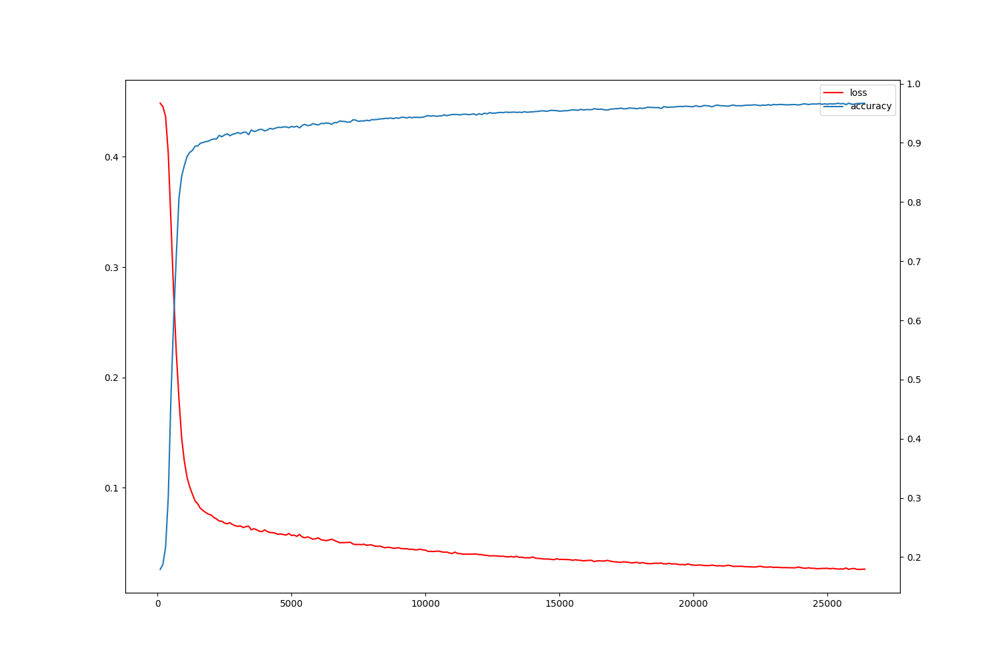
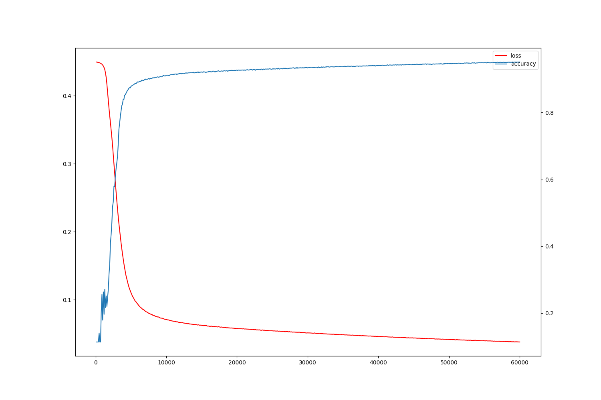
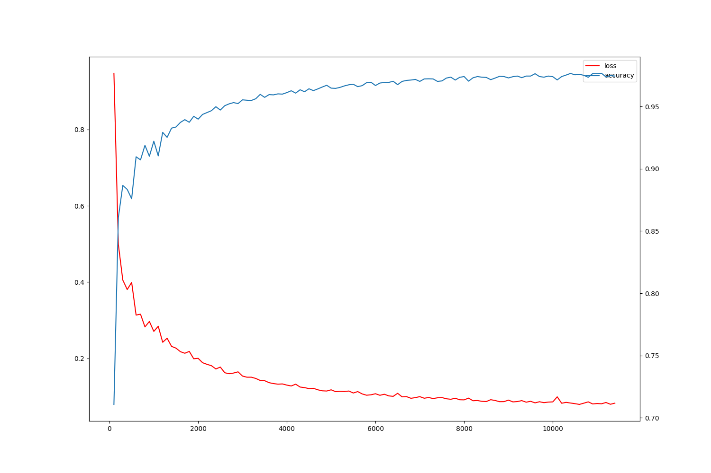
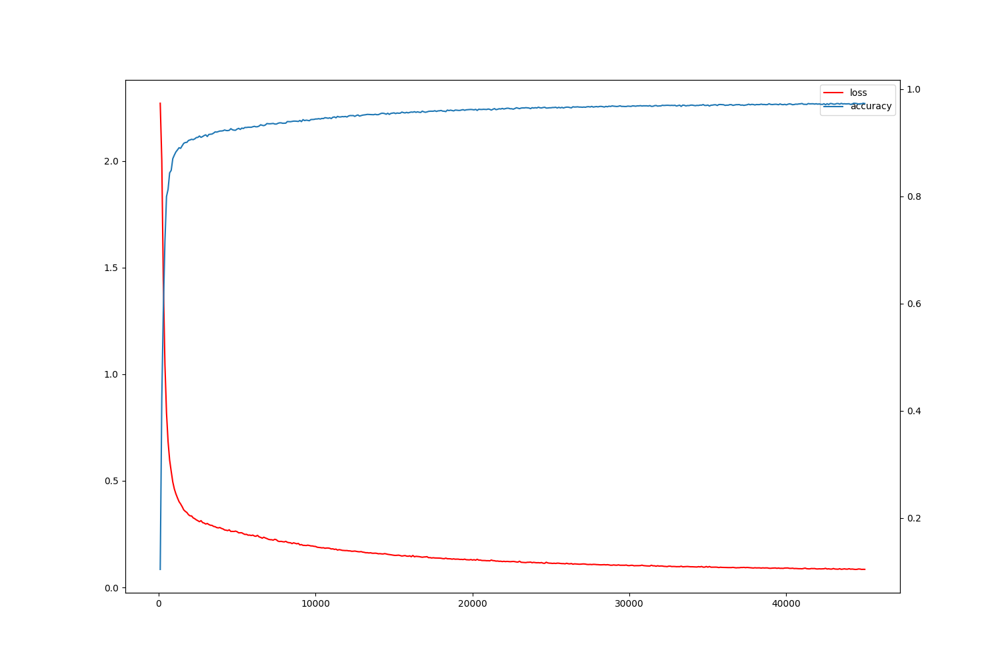
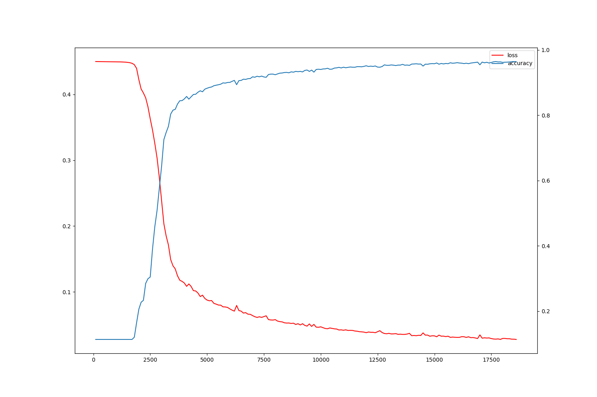
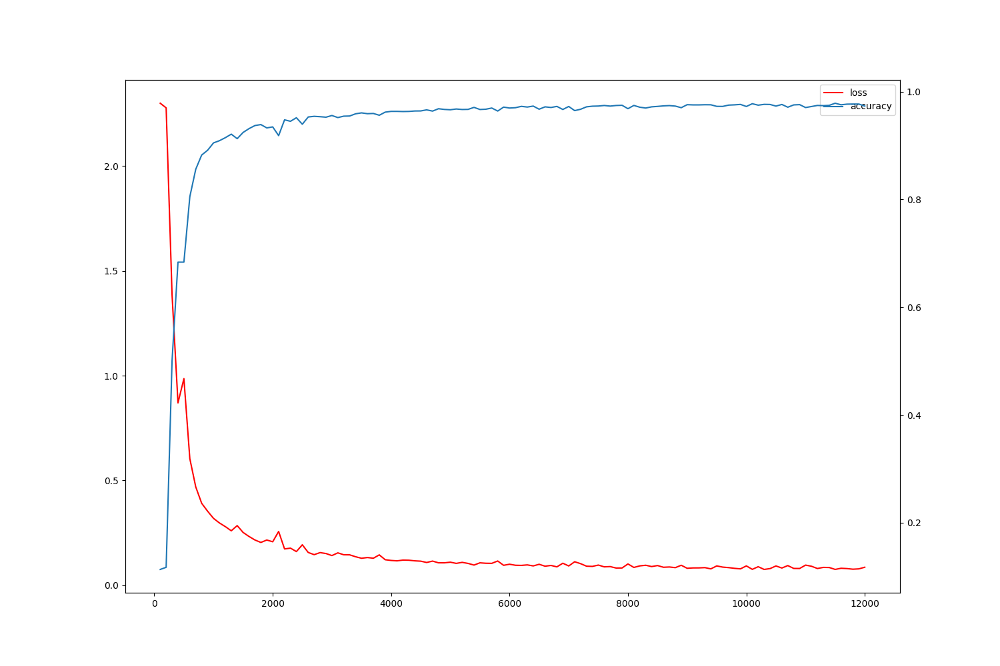

# MLP Report

## Overview

For input $x=[x_1,x_2,...,x_n]$

## Experiments

Basic Results:

|ID|Network Structure|Loss Function|Learning Rate|Train Time(s)|Best Accuracy(%)|
|----|----|----|----|----|----|----|
|0|Linear($784\times128$)->Relu->Linear($128\times10$)->Softmax|EuclideanLoss|0.1|179|96.7|
|1|Linear($784\times128$)->Sigmoid->Linear($128\times10$)->Softmax|EuclideanLoss|0.1|431|95.1|
|2|Linear($784\times128$)->Relu->Linear($128\times10$)->Softmax|CrossEntropyLoss|0.1|84.3|97.6|
|3|Linear($784\times128$)->Sigmoid->Linear($128\times10$)->Softmax|CrossEntropyLoss|0.1|326|97.4|
|4|Linear($784\times128$)->Relu->Linear($128\times128$)->Relu->Linear($128\times10$)->Softmax|EuclideanLoss|0.1|162|96.5|
|5|Linear($784\times128$)->Relu->Linear($128\times128$)->Relu->Linear($128\times10$)->Softmax|CrossEntropyLoss|0.1|101|98.1|

Loss-Accuracy Figures:
|ID|Figure|
|----|----|
|0||
|1||
|2||
|3||
|4||
|5||
